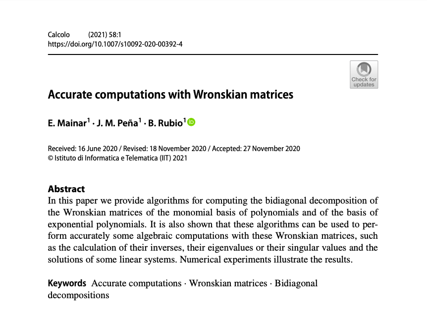

# Accurate computations with Wronskian matrices

In this repository, the bidiagonal decompositions (BDA) of Wronskian matrices of monomial basis and exponential basis are provided.

1. In [Wronkian_monomial](https://github.com/BeatriazRubio/Article_Calcolo2021/Wronskian_monomial) the bidiagonal decompositions of the Wronskian matrix of monomial basis is provided. Experiment results obtained with the functions available in http://math.mit.edu/~plamen/software/TNTool.html are presented. We also include the relative errors obtained in Mathematica. 
2. In [Wronkian_exponential](https://github.com/BeatriazRubio/Article_Calcolo2021/Wronskian_exponential) the bidiagonal decompositions of the Wronskian matrix of exponential basis is provided. Experiment results obtained with the functions available in http://math.mit.edu/~plamen/software/TNTool.html are presented. We also include the relative errors obtained in Mathematica. 

The implementation uses Matlab 2020b and Wolfram Mathematica. 

